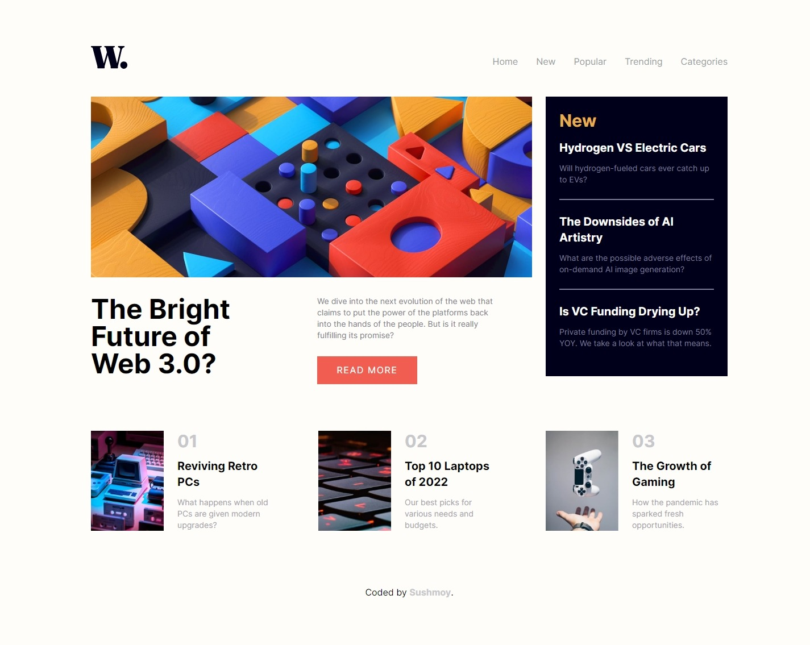

# News Homepage

This is a fully responsive grid layout news homepage with hover states implemented.

Live Site: [News Homepage](https://moysush.github.io/news-homepage/)

## Table of contents

- [Features](#features)
- [Screenshot](#screenshot)
- [Technologies Used](#technologies-used)
- [Lessons Learned](#lessons-learned)
- [Acknowledgments](#acknowledgments)

### Features

- View the optimal layout for the interface depending on their device's screen size
- See hover and focus states for all interactive elements on the page

### Screenshot

### Technologies Used

- Tailwind CSS

### Lessons Learned

- During the creation of this project, I enhanced my knowledge of Tailwind CSS, which provided me with an amazing learning experience. I can now confidently design grid layouts that work perfectly.

### Acknowledgments

This project is a solution to the challenges provided by [Frontend Mentor](https://www.frontendmentor.io/challenges/news-homepage-H6SWTa1MFl/hub), with additional features implemented by me.
